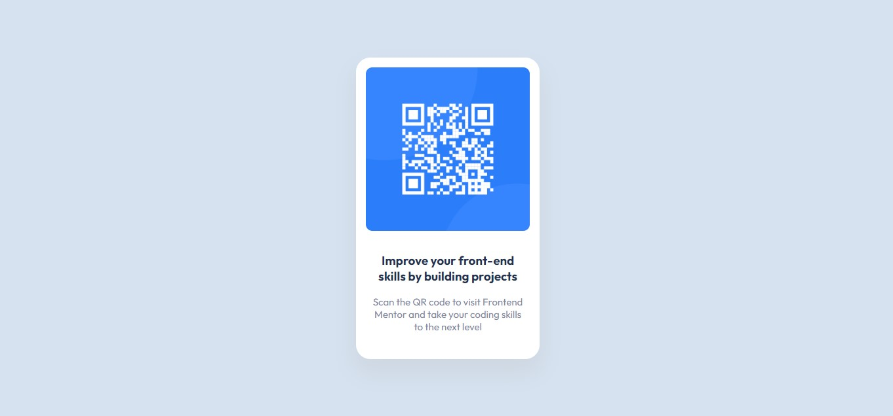

# Frontend Mentor - QR code component solution

This is a solution to the [QR code component challenge on Frontend Mentor](https://www.frontendmentor.io/challenges/qr-code-component-iux_sIO_H). Frontend Mentor challenges help you improve your coding skills by building realistic projects. 

## Table of contents

- [Screenshot](#screenshot)
- [Links](#links)
- [Built with](#built-with)
- [Author](#author)

### Screenshot

### Links

- Solution URL: [Github Repo](https://github.com/jahongirdev/frontendmentor-qrcode)
- Live Site URL: [Live preview](https://frontendmentor-qrcode-project.netlify.app/)

### Built with

- Semantic HTML5 markup
- CSS custom properties
- Flexbox
- CSS Grid

## Author

- Website - [Jahongir Murodboev](https://jahongirdev.netlify.app/)
- Frontend Mentor - [@jahongirdev](https://www.frontendmentor.io/profile/jahongirdev)
